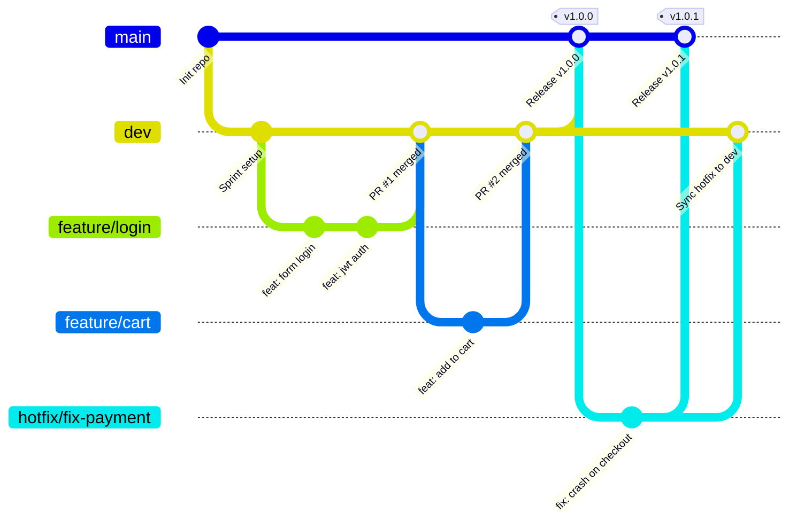

# 🚀 QUY TRÌNH LÀM VIỆC VỚI GIT (GIT WORKFLOW)

Tài liệu này hướng dẫn chi tiết quy trình làm việc với Git cho các thành viên trong nhóm, đảm bảo code không bị xung đột, dễ quản lý và luôn ổn định.

---

## 📌 1. Sơ đồ tổng quan (Git Flow Diagram)



---

## 🌳 2. Phân loại nhánh (Branch Strategy)

| Tên nhánh | Nhánh gốc (Branch out) | Hợp nhất vào (Merge to) | Mô tả & Quy định |
| :--- | :--- | :--- | :--- |
| **`main`** | — | — | **Chứa code Production (sản phẩm chạy thật).** Code phải tuyệt đối ổn định. <br>⚠️ **CẤM COMMIT TRỰC TIẾP.** Chỉ nhận code qua PR từ `dev` hoặc `hotfix/*`. |
| **`dev`** | `main` | `main` | **Nhánh làm việc chính của nhóm (Development).** Chứa các tính năng đã hoàn thành và chuẩn bị kiểm thử.<br>⚠️ **HẠN CHẾ COMMIT TRỰC TIẾP.** Khuyến khích tạo PR từ nhánh con. |
| **`feature/*`** | `dev` | `dev` | Dùng để phát triển một tính năng mới. |
| **`bugfix/*`** | `dev` | `dev` | Dùng để sửa lỗi phát hiện trong quá trình test trên nhánh `dev`. |
| **`hotfix/*`** | `main` | `main` **VÀ** `dev` | Dùng khi có lỗi nghiêm trọng phát sinh trực tiếp trên `main` (Production) cần xử lý khẩn cấp. |

---

## 📝 3. Quy chuẩn đặt tên

### 3.1. Đặt tên nhánh (Branch naming)
- Tính năng mới: `feature/<tên-chức-năng-ngắn-gọn>`
  - *Ví dụ:* `feature/login-jwt`, `feature/cart-checkout`, `feature/product-filter`
- Sửa lỗi thông thường: `bugfix/<mô-tả-lỗi>`
  - *Ví dụ:* `bugfix/cart-quantity-error`, `bugfix/css-navbar-overflow`
- Sửa lỗi khẩn cấp (Production): `hotfix/<mô-tả-lỗi>`
  - *Ví dụ:* `hotfix/security-vulnerability`, `hotfix/vnpay-callback-fail`

### 3.2. Quy chuẩn Commit Message (Conventional Commits)
Cấu trúc: `<loại>: <mô tả ngắn gọn>`
- `feat`: Thêm tính năng mới (`feat: add search product by category`)
- `fix`: Sửa lỗi (`fix: resolve NPE when user profile has no avatar`)
- `refactor`: Tối ưu lại code nhưng không đổi logic (`refactor: clean up AuthService`)
- `style`: Sửa format, CSS, căn lề (`style: align cart item table`)
- `docs`: Sửa tài liệu, README (`docs: update api endpoints in readme`)
- `chore`: Cập nhật cấu hình, thư viện pom.xml (`chore: bump spring-boot version`)

---

## 🛠️ 4. Hướng dẫn từng trường hợp chi tiết

---

### 👉 Trường hợp 1: Phát triển tính năng mới (`feature`)
*(Quy trình phổ biến nhất hằng ngày)*

#### Bước 1: Cập nhật code mới nhất của `dev`
Trước khi tạo nhánh mới, luôn đảm bảo code `dev` ở máy bạn là mới nhất:
```bash
git checkout dev
git pull origin dev
```

#### Bước 2: Tạo và chuyển sang nhánh feature mới
```bash
git checkout -b feature/cart-checkout
```

#### Bước 3: Code và commit theo từng phần nhỏ
```bash
git status
git add .
git commit -m "feat: design checkout page ui"
```

#### Bước 4: Đẩy nhánh lên remote repository
```bash
git push -u origin feature/cart-checkout
```
*(Những lần commit sau trên nhánh này, bạn chỉ cần gõ `git push`)*

#### Bước 5: Trước khi tạo PR, đồng bộ code mới từ `dev` để tránh conflict
Trong lúc bạn làm việc, đồng đội có thể đã merge code mới vào `dev`. Hãy lấy code mới về:
```bash
git checkout dev
git pull origin dev
git checkout feature/cart-checkout
git merge dev
# (Nếu có conflict thì giải quyết, sau đó commit)
git push origin feature/cart-checkout
```

#### Bước 6: Tạo Pull Request (PR) / Merge Request (MR)
- Vào GitHub/GitLab của dự án.
- Tạo PR với:
  - **Base branch (đích):** `dev`
  - **Compare branch (nguồn):** `feature/cart-checkout`
- Gắn người review (Reviewers).
- Sau khi được Approve và CI/CD pass, merge vào `dev`.
- Xóa nhánh `feature/cart-checkout` sau khi đã merge thành công.

---

### 👉 Trường hợp 2: Sửa lỗi phát hiện trong quá trình test trên `dev` (`bugfix`)
Tương tự như `feature`:
1. Tạo nhánh từ `dev`:
   ```bash
   git checkout dev
   git pull origin dev
   git checkout -b bugfix/fix-search-special-chars
   ```
2. Sửa lỗi, test kỹ lại.
3. Commit & push:
   ```bash
   git add .
   git commit -m "fix: handle special characters in product search query"
   git push -u origin bugfix/fix-search-special-chars
   ```
4. Tạo Pull Request vào `dev`.

---

### 👉 Trường hợp 3: Sửa lỗi khẩn cấp trên Production (`hotfix`)
Dùng khi code trên `main` đang chạy thật mà bị lỗi nghiêm trọng cần vá ngay lập tức.

#### Bước 1: Tách nhánh trực tiếp từ `main`
```bash
git checkout main
git pull origin main
git checkout -b hotfix/fix-order-cancel-deadlock
```

#### Bước 2: Sửa lỗi, kiểm thử và commit
```bash
git add .
git commit -m "fix: resolve deadlock on simultaneous order cancellation"
git push -u origin hotfix/fix-order-cancel-deadlock
```

#### Bước 3: Tạo 2 Pull Request (Cực kỳ quan trọng!)
1. **PR 1:** Merge `hotfix/...` vào **`main`** (để deploy sửa lỗi ngay cho khách hàng).
2. **PR 2:** Merge `hotfix/...` vào **`dev`** (để các tính năng đang phát triển cũng có bản sửa lỗi này, tránh bị lỗi lại ở lần release sau).

---

### 👉 Trường hợp 4: Xử lý khi bị xung đột code (Merge Conflict)

Khi bạn merge `dev` vào nhánh của bạn hoặc khi tạo PR mà báo **"Conflicts"**:

1. Chạy lệnh merge `dev` vào nhánh của bạn:
   ```bash
   git checkout feature/ten-nhanh-cua-ban
   git merge dev
   ```
2. Mở trình soạn thảo (VS Code / IntelliJ IDEA / Eclipse):
   - Git sẽ đánh dấu các đoạn xung đột giữa `<<<<<<< HEAD` và `>>>>>>> dev`.
   - Trao đổi với thành viên viết đoạn code đó (nếu không chắc chắn).
   - Chọn giữ code của ai (Accept Current / Accept Incoming / Accept Both).
3. Đánh dấu đã giải quyết xong và commit:
   ```bash
   git add .
   git commit -m "merge: resolve conflicts with dev branch"
   git push origin feature/ten-nhanh-cua-ban
   ```

---

### 👉 Trường hợp 5: Khi bàn giao / Đóng Sprint (Release từ `dev` sang `main`)
Khi các tính năng trên `dev` đã hoàn tất, được test đầy đủ:
1. Tạo PR từ **`dev`** vào **`main`**.
2. Nhóm trưởng/Tech Lead review và merge.
3. Tạo Git Tag đánh dấu phiên bản (nếu cần):
   ```bash
   git checkout main
   git pull origin main
   git tag -a v1.0.0 -m "Release version 1.0.0"
   git push origin v1.0.0
   ```

---

## 🚫 5. Những điều TUYỆT ĐỐI KHÔNG ĐƯỢC LÀM (Git Don'ts)

1. ❌ **KHÔNG** chạy `git push --force` (hoặc `-f`) lên các nhánh chung như `main`, `dev`.
2. ❌ **KHÔNG** commit trực tiếp lên nhánh `main`.
3. ❌ **KHÔNG** commit các file build/rác, file cấu hình cá nhân hoặc thông tin nhạy cảm:
   - Thư mục Maven: `target/`
   - File IDE: `.idea/`, `.vscode/`, `*.iml`
   - File nhạy cảm: mật khẩu database, file chứa API key bí mật, `.env`
   *(Hãy kiểm tra kỹ file `.gitignore`)*
4. ❌ **KHÔNG** gom quá nhiều tính năng không liên quan vào 1 nhánh hoặc 1 commit. Hãy chia nhỏ để dễ review và rollback nếu có lỗi.
